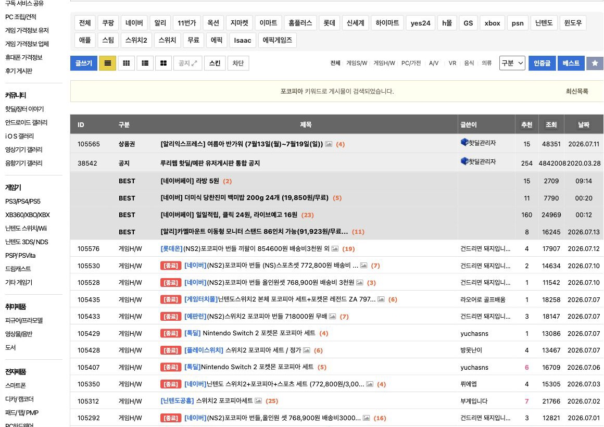
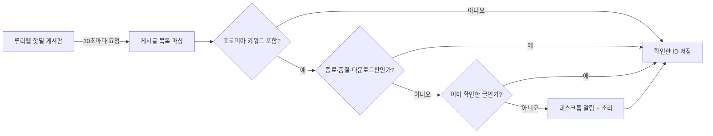

# Pokopia Stock Monitor


> 루리웹 핫딜 게시판에서 포켓몬 포코피아 관련 게시글을 주기적으로 찾아 데스크톱 알림으로 알려 주는 개인용 모니터링 도구

이 프로젝트는 공식 재고 API를 조회하는 서비스가 아닙니다. 빠르게 올라왔다가 종료되는 **커뮤니티 핫딜 게시글을 재입고 신호로 활용**해, 사람이 게시판을 계속 새로고침해야 하는 일을 자동화했습니다.

> **프로젝트 상태: 완료** — 개인 사용 목적을 달성해 2026-07-14부로 운영과 기능 개발을 종료했습니다. 아래 내용은 문제 해결 과정과 기술적 판단을 보존하기 위한 기록입니다.



<sub>루리웹 핫딜 게시판에서 `포코피아`를 검색한 화면 · 2026-07-14 캡처 · 화면과 게시글의 권리는 원저작자에게 있습니다.</sub>

## 프로젝트 한눈에 보기

| 고민 | 해결 방법 |
| --- | --- |
| 게시판을 반복해서 새로고침해야 했다 | `requests`로 30초마다 목록을 확인하는 폴링 방식 적용 |
| 관련 없는 글이나 이미 끝난 판매가 섞였다 | 포함 키워드와 제외 키워드를 분리해 제목 필터링 |
| 같은 게시글이 계속 알림으로 왔다 | 확인한 게시글 ID를 `seen_ids.json`에 저장해 중복 방지 |
| 발견해도 늦게 보면 의미가 없었다 | Windows/macOS 데스크톱 알림과 소리로 즉시 전달 |
| 작은 개인 문제에 과한 시스템은 부담이었다 | 서버·DB 없이 단일 Python 프로세스와 로컬 JSON으로 구성 |

## 동작 방식



핵심 필터는 다음 두 목록으로 분리했습니다.

```python
KEYWORDS = ["포코피아", "포켓몬 포코피아", "Pokopia"]
EXCLUDE_KEYWORDS = ["종료", "품절", "마감", "다운로드", "DL판", "🔒"]
```

## 주요 기능

- 루리웹 핫딜/예판 유저 게시판의 게시글 제목과 링크 수집
- 한글·영문 상품명 변형을 포함하는 대소문자 비구분 검색
- 종료, 품절, 마감, 다운로드판 등의 오탐 제외
- 최근 확인한 게시글 ID 최대 500개를 로컬에 보존
- Windows 알림·시스템 소리 및 macOS 알림·효과음 지원
- 네트워크 오류 발생 시 프로세스를 종료하지 않고 다음 주기에 재시도

## 실행 방법

현재 프로젝트는 운영하지 않지만, 과거 실행 환경을 재현하려면 다음 순서를 사용합니다.

```bash
git clone https://github.com/Joyanggi/pokopia_stock_monitor.git
cd pokopia_stock_monitor

python3 -m venv .venv
source .venv/bin/activate  # Windows: .venv\Scripts\activate
pip install -r requirements.txt

python pokopia.py
```

종료는 `Ctrl+C`를 누르면 됩니다. 실행 중 생성되는 `seen_ids.json`은 중복 알림 방지를 위한 로컬 상태 파일이며 Git에는 포함되지 않습니다.

## 설정

별도 설정 파일 없이 [pokopia.py](pokopia.py) 상단의 상수를 조정합니다.

| 상수 | 기본값 | 역할 |
| --- | --- | --- |
| `CHECK_INTERVAL_SECONDS` | `30` | 게시판 확인 주기(초) |
| `KEYWORDS` | 포코피아 명칭 3종 | 알림 후보에 포함할 단어 |
| `EXCLUDE_KEYWORDS` | 종료·품절 등 6종 | 알림에서 제외할 단어 |
| `RULIWEB_URL` | 핫딜 게시판 URL | 모니터링 대상 |

## 설계 판단과 트레이드오프

- **폴링을 선택한 이유**: 공식 웹훅이나 재고 API가 없는 상황에서 가장 빠르게 만들고 검증할 수 있었습니다. 대신 요청 주기가 짧을수록 대상 사이트에 부담이 될 수 있습니다.
- **커뮤니티 게시글을 신호로 사용한 이유**: 여러 판매처를 각각 연동하는 것보다 구현 범위가 작았습니다. 대신 게시글이 실제 재고를 보장하지는 않습니다.
- **JSON 파일을 사용한 이유**: 단일 사용자·단일 프로세스에는 DB가 과했습니다. 대신 여러 기기 간 상태 공유나 동시 실행은 지원하지 않습니다.
- **제목 기반 규칙을 선택한 이유**: 설명 가능하고 바로 수정할 수 있습니다. 대신 새로운 표기나 게시판 HTML 변경에는 수동 대응이 필요합니다.

더 자세한 문제 해결 과정, 실제 커밋 이력, 이력서용 문장과 면접 설명 초안은 [프로젝트 회고](docs/RETROSPECTIVE.md)에 정리했습니다.

## 한계와 이용 시 주의사항

- 대상 사이트의 HTML 구조가 바뀌면 선택자 수정이 필요합니다.
- 로컬 프로그램이 실행 중일 때만 알림을 받을 수 있습니다.
- 커뮤니티 게시글은 실제 판매처의 재고·가격을 보장하지 않습니다.
- 재사용 시 대상 사이트의 이용 정책을 확인하고 확인 주기를 무리하게 줄이지 마세요.
- 이 저장소는 완료된 개인 프로젝트의 기록이며 적극적인 유지보수는 예정되어 있지 않습니다.

## 기술 스택

- Python
- Requests
- Beautiful Soup
- JSON 기반 로컬 상태 저장
- Windows `plyer` / macOS `osascript`, `afplay`
